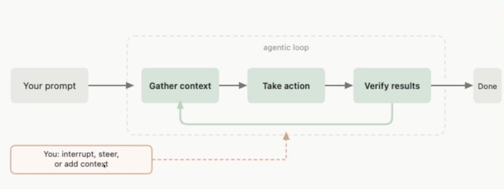
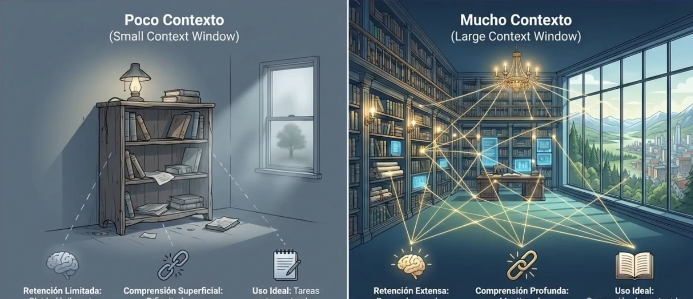
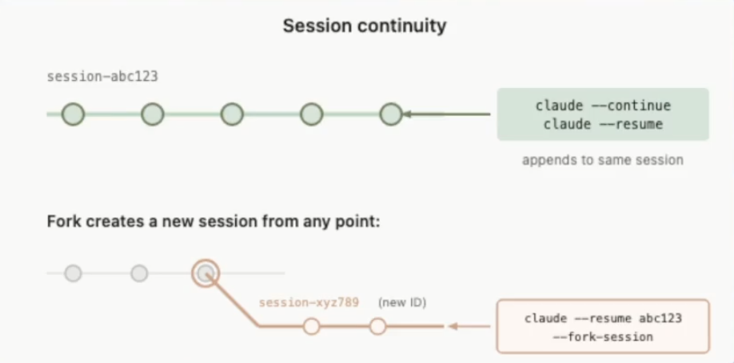

Objetivos de la clase 🎯

Entender el agent loop y como funciona Claude Code

# CONCEPTOS

(23/09/2026)

1 - Que es una agentic Loop?

Imagina que le dices a Claude Code: «Ayúdame a resolver un problema en mi proyecto».

Según el diagrama, ocurre lo siguiente:

-----
#### AGENTIC LOOP

-> Gather context — reunir contexto: lee tu pedido y revisa la información necesaria.

-> Take action — actuar: decide qué paso dar y lo realiza; por ejemplo, modifica un archivo.

-> Verify results — verificar resultados: comprueba si esa acción resolvió el problema.

Si todavía hay un error, vuelve a reunir contexto y repite el ciclo. Cuando verifica que cumplió el objetivo, llega a Done.
 
-----

Tú también puedes intervenir en cualquier momento para orientar el trabajo: «Revisa este archivo» o «No cambies esa parte». Claude Code incorpora esa información en los siguientes pasos.

En pocas palabras: un agentic loop es el ciclo entender → actuar → comprobar → ajustar que un agente repite mientras trabaja en un objetivo.

## Modelos
Los modelos son el corazón del desarrollo asistido por AI.

Estos solo reciben una entrada y entregan una salida.

No tienen memoria, no conocen tu negocio.

Algunos modelos disponibles en Claude:
1. Modelo Opus (Potencia Extrema)
Características:
Razonamiento Superior
Análisis de Datos Complejos
Resolución de Problemas

2. Modelo Sonnet (Equilibrio Rendimiento)
Características:
Velocidad y Calidad
Contexto Amplio
Ejecución de Código

3. Modelo Haiku (Rapidez Ágil)
Características:Latencia Mínima
Tareas de Alta Frecuencia
Consultas Sencillas

Tools

Es software que le permite a Claude Code realizar acciones sobre la plataforma.

Algunas de las herramientas que son parte de Claude Code:

- Agent
- Bash
- Edit
- Skill
- WebFetch
- WebSearch
- Write

## Ventana de contexto

Es la cantidad de tokens que puede procesar la herramienta.

Las conversaciones que tenemos, los archivos del proyecto y las herramientas que usamos: todo esto es o puede ser parte del
contexto.

## Sesion

Cada vez que abrimos Claude Code se genera una sesión; en esta se guarda cada mensaje y las herramientas usadas.

Esto permite reanudar una conversación anterior.

Las sesiones están ligadas a una carpeta.

## Agentic Harness

Permite a Claude Code interactuar de forma autónoma y segura con el sistema de archivos y las herramientas del entorno local.

- Permission System: Control granular sobre qué comandos y archivos puede tocar el agente.

- Tool Sandbox: Ejecución segura de herramientas CLI y scripts en el entorno del usuario.

- Orchestrator: Gestión de ciclos de pensamiento y llamadas a herramientas.

2 - Arquitectura

## Memoria

Claude Code no conoce nuestro flujo de trabajo; hay muchos detalles de nuestra operación que no conoce.

Para poder darle información a Claude Code usamos un archivo llamado `CLAUDE.md`. Con esto, el conocimiento estará disponible para todas las sesiones.

Estos archivos se organizan por scope.

## Scope

Permite definir la jerarquía de configuraciones y contexto que se aplica en la sesión.

- Managed: políticas que define la organización.

- User: preferencias personales y configuraciones personales.

- Project: configuraciones por proyecto y compartidas con el equipo.

- Local: configuraciones específicas para el usuario.

## Contexto

| Componente | Rol en la arquitectura de contexto |
| --- | --- |
| `CLAUDE.md` | Memoria persistente y guía de estilo para el proyecto. |
| Skills | Capacidades modulares y herramientas reutilizables. |
| SubAgents | Delegación de tareas complejas a procesos especializados. |
| Commands | Instrucciones directas y disparadores de flujos específicos. |
| MCPs | Protocolo de Contexto Modelo para integración de datos externos. |

## Links

- Funcionamiento de Claude Code: [How Claude Code works](https://code.claude.com/docs/en/how-claude-code-works)

- Referencia a modelos: [Model configuration](https://code.claude.com/docs/en/model-config)

- Referencia a tools: [Tools reference](https://code.claude.com/docs/en/tools-reference)

- Claude Code Settings: [Settings](https://code.claude.com/docs/en/settings)
